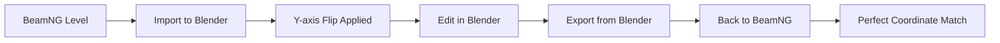

# BeamNG.drive Blender Importer/Exporter

A comprehensive Blender addon for **importing and exporting** BeamNG.drive level data, featuring **complete round-trip terrain workflows** with 16-bit EXR displacement textures and coordinate system correction.


## 🌟 Features

### ✅ **Current**
- **🏞️ Complete Terrain Workflow** - Full import/export pipeline with BeamNG `.ter` files
- **🔄 Round-trip Support** - Import, edit, and export back to BeamNG with coordinate consistency
- **📸 16-bit EXR Textures** - High-precision displacement and layermap textures for non-destructive editing
- **🎨 Blender Integration** - Use Blender's texture painting tools to modify terrain
- **⚡ Geometry Nodes** - Real-time preview with advanced node-based terrain system
- **🛣️ DecalRoad Import** - Import road networks with materials and geometry nodes
- **🗺️ Coordinate Correction** - Automatic handling of BeamNG ↔ Blender coordinate system differences
- **📁 Level Detection** - Smart BeamNG level directory validation and parsing

### 🔄 **Coming Soon**
- **Static Objects Export** - Export prefab objects and meshes to `.prefab` files
- **Advanced Materials** - Multi-layer terrain textures and blending
- **Texture Pipeline** - DDS texture conversion and optimization

## 📦 Installation

### Automatic Install (Recommended)
```bash
# Clone repository
git clone https://github.com/yourusername/beamng-blender-addon.git
cd beamng-blender-addon

# Run installation script
chmod +x quick_install.sh
./quick_install.sh
```

### Manual Install
1. Download or clone this repository
2. Copy `beamng_blender_addon/` to your Blender addons directory:
   - **macOS**: `~/Library/Application Support/Blender/4.x/scripts/addons/`
   - **Windows**: `%APPDATA%/Blender Foundation/Blender/4.x/scripts/addons/`
   - **Linux**: `~/.config/blender/4.x/scripts/addons/`
3. Open Blender > Edit > Preferences > Add-ons
4. Search for "BeamNG" and enable the addon

## 🚀 Complete Workflow

### 📥 **Step 1: Import BeamNG Terrain**

1. **Access Import Dialog**
   - Go to `File → Import → BeamNG Level (.ter, .prefab)`
   - Browse to your BeamNG level directory (contains `.ter` and `.terrain.json` files)

2. **Configure Import Options**
   - ✅ **Import Terrain** - Import heightmap and materials
   - ✅ **Import Objects** - Import prefab objects (placeholder)
   - ✅ **Import Materials** - Create terrain materials
   - ✅ **Import DecalRoads** - Import road networks

3. **Click Import**
   - The addon automatically detects terrain parameters and applies coordinate correction

### 🎯 **Import Results**
- **`BeamNG_Terrain`** object with geometry nodes modifier
- **`BeamNG_Terrain_Displacement.exr`** - 16-bit heightmap texture
- **`BeamNG_Terrain_Layermap.exr`** - Material assignment texture (if available)
- **DecalRoad curves** with proper materials and geometry nodes
- **Automatic coordinate correction** (Y-axis flip applied during import)

### 🎨 **Step 2: Edit Terrain in Blender**

1. **Texture Painting Workflow**
   ```
   Switch to Shading workspace
   → Select BeamNG_Terrain object
   → Open Shader Editor
   → Select displacement texture node
   → Switch to Texture Paint workspace
   → Paint directly on the EXR texture
   ```

2. **Advanced Editing**
   - **Sculpting**: Use Blender's sculpt tools on the subdivided mesh
   - **Modifiers**: Add noise, displacement, or other modifiers
   - **Material Painting**: Edit the layermap texture to change terrain materials
   - **Geometry Nodes**: Modify the terrain node group for advanced effects

3. **Real-time Preview**
   - Changes to EXR textures update automatically in the viewport
   - Use **Material Preview** or **Rendered** viewport shading for best results

### 📤 **Step 3: Export Back to BeamNG**

1. **Access Export Dialog**
   - Go to `File → Export → BeamNG Level`
   - Choose destination directory for your custom level

2. **Configure Export Options**
   - ✅ **Export Terrain** - Generate `.ter` and `.terrain.json` files
   - ✅ **Export Objects** - Export prefab objects (placeholder)
   - ✅ **Export Materials** - Export material definitions
   - ✅ **Export Config** - Generate level configuration files
   - **Level Name**: Set name for your exported level

3. **Click Export**
   - Creates complete BeamNG level directory structure
   - Generates properly formatted `.ter` file with material data
   - No coordinate transformation needed (already corrected during import)

### 🎮 **Step 4: Test in BeamNG**

1. **Install Your Level**
   ```
   Copy exported level folder to:
   BeamNG.drive/mods/unpacked/levels/[your_level_name]/
   ```

2. **Launch BeamNG**
   - Start BeamNG.drive
   - Go to Levels menu
   - Select your custom level
   - Terrain should appear identical to your Blender edits

### 🔄 **Round-trip Workflow Summary**



**Key Benefits:**
- **Non-destructive**: Original data preserved in 16-bit EXR textures
- **Coordinate consistency**: Automatic handling of coordinate system differences
- **Live preview**: Real-time feedback during editing
- **Complete pipeline**: Import → Edit → Export → Test

## 📋 Requirements

- **Blender 4.0+** (tested with 4.3)
- **Python 3.9+** with NumPy
- **BeamNG.drive** (for test data)

## 🗂️ Supported File Formats

### ✅ Currently Supported
- **`.ter`** - Binary terrain heightmaps (with corrected parser)
- **`.terrain.json`** - Terrain configuration metadata
- **Level Detection** - `info.json`, `mainLevel.lua`

### 🔄 Planned Support
- **`.prefab`** - TorqueScript object definitions
- **`.dds`** - DirectDraw Surface textures
- **`.json`** - Various configuration files
- **`.dae`** - Collada mesh files

## 🏗️ Technical Details

### Import Pipeline
1. **Binary Parsing** - Read `.ter` files using corrected format (offset 0x05, little-endian)
2. **Coordinate Transformation** - Apply Y-axis flip to convert BeamNG bottom-left origin to Blender top-left
3. **16-bit EXR Creation** - Generate high-precision displacement and layermap textures
4. **Geometry Nodes Setup** - Create advanced node-based terrain system with real-time preview
5. **Material Assignment** - Set up PBR materials with proper displacement and texture nodes

### Export Pipeline
1. **Texture Extraction** - Read EXR textures from Blender scene (displacement + layermap)
2. **Data Conversion** - Convert float textures back to 16-bit heightmaps and 8-bit material maps
3. **Binary Writing** - Generate BeamNG-compatible `.ter` files with material data
4. **Configuration Export** - Create `.terrain.json` with proper metadata and material lists

### Coordinate System Handling
- **BeamNG**: Bottom-left origin, Y-axis increases south→north
- **Blender**: Top-left origin, Y-axis increases top→bottom
- **Solution**: Single Y-axis flip during import, no transformation needed during export
- **Result**: Perfect coordinate consistency in round-trip workflow

### Performance Considerations
- **Geometry Nodes**: Real-time viewport updates with efficient subdivision
- **16-bit Precision**: No quality loss during import/export cycle
- **Memory Efficient**: EXR textures packed in Blender, minimal memory overhead
- **Viewport Performance**: Adaptive subdivision based on view distance

## 🧪 Testing & Validation

### Recommended Test Levels
```bash
# Default BeamNG installation (Steam)
Windows: "Program Files (x86)/Steam/steamapps/common/BeamNG.drive/content/levels/levels/"
macOS: "/Volumes/Goodboy/crossover/Steam/drive_c/Program Files (x86)/Steam/steamapps/common/BeamNG.drive/content/levels/levels/"

# Recommended levels for testing:
- small_island      # 1024x1024 island with varied terrain
- gridmap_v2        # Flat grid, good for coordinate testing
- automation        # Complex multi-biome terrain
- hirochi_raceway   # Road-heavy level for DecalRoad testing
```

### Complete Test Workflow
1. **Import Test**
   - Navigate to a level directory (e.g., `small_island/`)
   - Import using `File → Import → BeamNG Level`
   - Verify terrain shape, roads, and coordinate alignment

2. **Edit Test**
   - Switch to Texture Paint workspace
   - Make visible changes to the displacement texture
   - Verify real-time preview updates

3. **Export Test**
   - Export using `File → Export → BeamNG Level`
   - Set level name (e.g., "test_level")
   - Check generated `.ter` and `.terrain.json` files

4. **Game Test**
   - Copy exported level to BeamNG mods directory
   - Launch BeamNG and select your custom level
   - Verify terrain appears identical to Blender version
   - Test coordinate consistency (features in same positions)

## 📈 Development Status

**Current Status: Core Functionality Complete**
- ✅ **Complete Terrain Pipeline**: Import/export with coordinate correction
- ✅ **16-bit EXR Workflow**: Non-destructive terrain editing
- ✅ **DecalRoad Support**: Road networks with materials and geometry nodes
- ✅ **Geometry Nodes Integration**: Advanced node-based terrain system
- ✅ **Material System**: Automated PBR material setup
- ✅ **Level Detection**: Smart BeamNG level directory parsing

**Next Development Priorities:**
- 🔄 **Static Objects Export**: Export prefab objects from Blender
- 🔄 **Advanced Materials**: Multi-layer terrain texture blending
- 🔄 **Optimization**: Performance improvements for large terrains

See [BeamNG_Blender_Task_Breakdown.md](BeamNG_Blender_Task_Breakdown.md) for detailed progress.

## 🐛 Known Issues & Troubleshooting

### Known Limitations
- **Static Object Export**: Not yet implemented (prefab objects)
- **Multi-layer Materials**: Advanced terrain blending not available
- **Large Terrain Performance**: Very high subdivision levels may cause lag

### Common Issues & Solutions

**"No BeamNG terrain object found in scene"**
- Ensure you have a `BeamNG_Terrain` object in your scene
- Check that the object hasn't been renamed or deleted
- Try re-importing the level if the terrain object is missing

**"Could not extract displacement data from terrain object"**
- Verify the terrain object has geometry nodes modifier
- Check that displacement texture exists in the node group
- Ensure the texture is named with "displacement" in the name

**"Terrain appears flipped or rotated in BeamNG"**
- This should not occur with the current version (coordinate correction applied)
- If it does occur, please report as a bug with your test level details

**"Exported terrain is all flat"**
- Check that the displacement texture has visible height variations
- Verify the texture is properly connected in the geometry nodes
- Ensure you're not painting on a copy of the texture

**"Export dialog not appearing"**
- Ensure the addon is properly enabled in Blender preferences
- Try reloading the addon using the hot-reload script (see Development section)
- Check the Blender console for error messages

## 🔧 Development & Debugging

### Hot-Reload Addon During Development

When developing or debugging the addon, you can hot-reload it without restarting Blender:

1. **Open Blender's Scripting Workspace**
2. **Paste this code snippet** into the text editor:

```python
def reload_addon(module_name='beamng_blender_addon'):
    import sys
    modules_to_remove = [name for name in sys.modules.keys() if name.startswith(module_name)]
    for module_name in modules_to_remove:
        del sys.modules[module_name]
    
    # Now disable and re-enable
    import addon_utils
    addon_utils.disable(module_name)
    addon_utils.enable(module_name)
    
reload_addon()
```

3. **Run the script** - This will completely reload the addon with your latest changes
4. **Alternative**: You can also run this one-liner in the Python console:
   ```python
   exec("import sys; [sys.modules.pop(k) for k in [k for k in sys.modules.keys() if k.startswith('beamng_blender_addon')]]; import addon_utils; addon_utils.disable('beamng_blender_addon'); addon_utils.enable('beamng_blender_addon')")
   ```

This method cleans the Python module cache and forces a complete reload, which is more reliable than the standard disable/enable approach for complex multi-module addons.

## 🤝 Contributing

1. Fork the repository
2. Create feature branch (`git checkout -b feature/amazing-feature`)
3. Commit changes (`git commit -m 'Add amazing feature'`)
4. Push branch (`git push origin feature/amazing-feature`)
5. Open Pull Request

## 📝 License

This project is licensed under Unlicense - see [LICENSE](LICENSE) for details.

## 🙏 Acknowledgments

- BeamNG GmbH for the amazing BeamNG.drive simulation
- Blender Foundation for the powerful 3D creation suite
- Community contributors and testers

---

For issues or questions, please open a GitHub issue. 